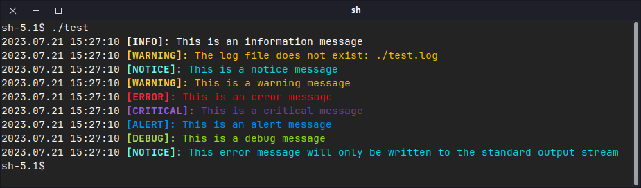
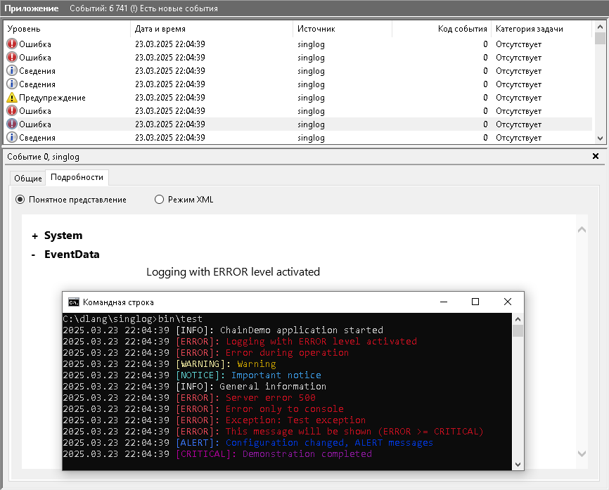

[](https://www.gnu.org/licenses/old-licenses/gpl-2.0.html)
[](https://git.zhirov.kz/dlang/singlog)
[](https://github.com/AlexanderZhirov/singlog)
[](https://code.dlang.org/packages/singlog)
[](https://www.linux.org/)
[](https://support.microsoft.com/en-US/windows)

# `singlog` - Singleton Logging Module

`singlog` is a singleton logging module written in the D programming language, designed to provide thread-safe, cross-platform logging with flexible output targets. It supports multiple log levels, configurable output destinations (syslog, console, file), and optional colored console output, making it a versatile tool for application logging.





## Features

- **Thread-Safety**: Utilizes a `Mutex` to ensure safe logging in multi-threaded applications.
- **Cross-Platform**: Works on both Windows (Event Log, console) and POSIX (syslog, console) systems.
- **Flexible Output Targets**: Supports logging to:
  - System logs (syslog on POSIX, Event Log on Windows).
  - Standard output (`stdout` for NOTICE and above, `stderr` for ERROR and below).
  - Files (with configurable file paths).
- **Log Levels**: Seven configurable levels:
  - `DEBUGGING` (highest priority)
  - `ALERT`
  - `CRITICAL`
  - `ERROR`
  - `WARNING`
  - `NOTICE`
  - `INFORMATION` (lowest priority)
- **Fluent Interface**: Provides a chaining API for easy configuration of output targets, log levels, and settings.
- **Colored Output**: Optional ANSI color support for console messages (on POSIX) or Windows console colors.
- **Singleton Design**: Ensures a single logger instance throughout the application, accessible via `Log.msg` or the `log` alias.
- **Aliases**: Short aliases (e.g., `d` for `debugging`, `e` for `error`) for concise logging.

## Installation

To use `singlog`, include it in your D project:

1. **Via Source**: Copy the `singlog.d` file into your project’s source directory.
2. **Via DUB** (if packaged):

   Add it to your `dub.json`:
   ```json
   "dependencies": {
       "singlog": "~>1.0.0"
   }
   ```

## Usage

### Basic Configuration and Logging

The `singlog` module provides a singleton logger instance accessible via `Log.msg` or the global `log` alias. Here’s a basic example:

```d
import singlog;

void main() {
    // Configure the logger
    log.program("MyApp")                   // Set program name for syslog/Event Log
       .color(true)                        // Enable colored console output
       .level(log.level.debugging)         // Set minimum log level to DEBUGGING
       .output(log.output.std.file.syslog) // Output to console, file, and syslog
       .file("./myapp.log");               // Set log file path

    // Log messages
    log.debugging("Starting application in debug mode");
    log.information("Initialization complete");
    log.error("Failed to load resource");
}
```

This configures the logger to:
- Identify as "MyApp" in system logs.
- Use colored output on the console.
- Log all messages (from `DEBUGGING` up).
- Write to the console, a file (`myapp.log`), and the system log.

### Log Levels and Aliases

The logger supports seven log levels with corresponding methods and aliases:

| Level         | Method            | Alias | Description                  |
|---------------|-------------------|-------|------------------------------|
| `DEBUGGING`   | `debugging()`     | `d()` | Debugging information        |
| `ALERT`       | `alert()`         | `a()` | High-priority alerts         |
| `CRITICAL`    | `critical()`      | `c()` | Critical errors              |
| `ERROR`       | `error()`         | `e()` | General errors               |
| `WARNING`     | `warning()`       | `w()` | Warnings                     |
| `NOTICE`      | `notice()`        | `n()` | Notices                      |
| `INFORMATION` | `information()`   | `i()` | Informational messages       |

Example using aliases:

```d
log.d("Debug message");
log.i("Info message");
log.e("Error message");
```

### Output Targets

Output targets can be configured using the `output()` method and its fluent interface:

- `syslog()`: Logs to the system log (Event Log on Windows, syslog on POSIX).
- `std()`: Logs to the console (`stdout` or `stderr` based on log level).
- `file()`: Logs to a file (requires `file()` to set the path).

Example:

```d
log.output(log.output.std.file); // Console and file output
log.i("This goes to console and file");
```

### Temporary Output Override

Use `now()` to temporarily override output targets for the next log call:

```d
log.now(log.output.std).n("This goes only to console");
log.i("This uses default outputs again");
```

### Colored Output

Enable colored output with `color(true)`:

```d
log.color(true);
log.w("This warning will be yellow on POSIX or Windows");
log.c("This critical message will be magenta");
```

Colors differ by platform:
- **POSIX**: Uses ANSI escape codes (e.g., green for `DEBUGGING`, red for `ERROR`).
- **Windows**: Uses console color attributes (e.g., yellow for `WARNING`, white for `INFORMATION`).

### File Logging

Set a log file with `file()`:

```d
log.file("app.log");
log.e("This error goes to app.log");
```

The file is opened in append mode (`"a+"`) and includes timestamps.
